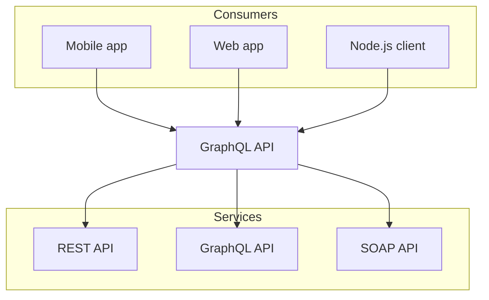

# 测试

Hello Nextra

这个地方将是你的Wiki文档库，欢迎来到Nextra

不知道为什么是现在这个样子的，但是呢，现在还可以

不知道你在干什么

~很好看吗~

*henhaokan1de1*

**henouyisi1a**

# 测试latex

```math
a^2 \div a^3
```

# mermaid测试


```mermaid
graph TD;
subgraph AA [Consumers]
A[Mobile app];
B[Web app];
C[Node.js client];
end
subgraph BB [Services]
E[REST API];
F[GraphQL API];
G[SOAP API];
end
Z[GraphQL API];
A --> Z;
B --> Z;
C --> Z;
Z --> E;
Z --> F;
Z --> G;
```